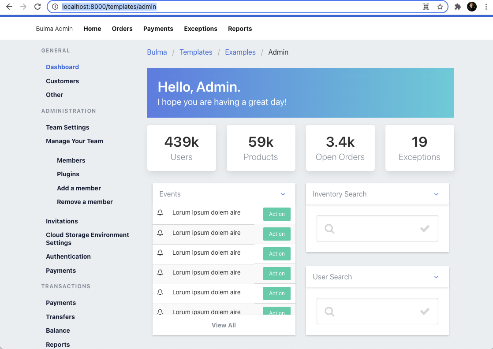
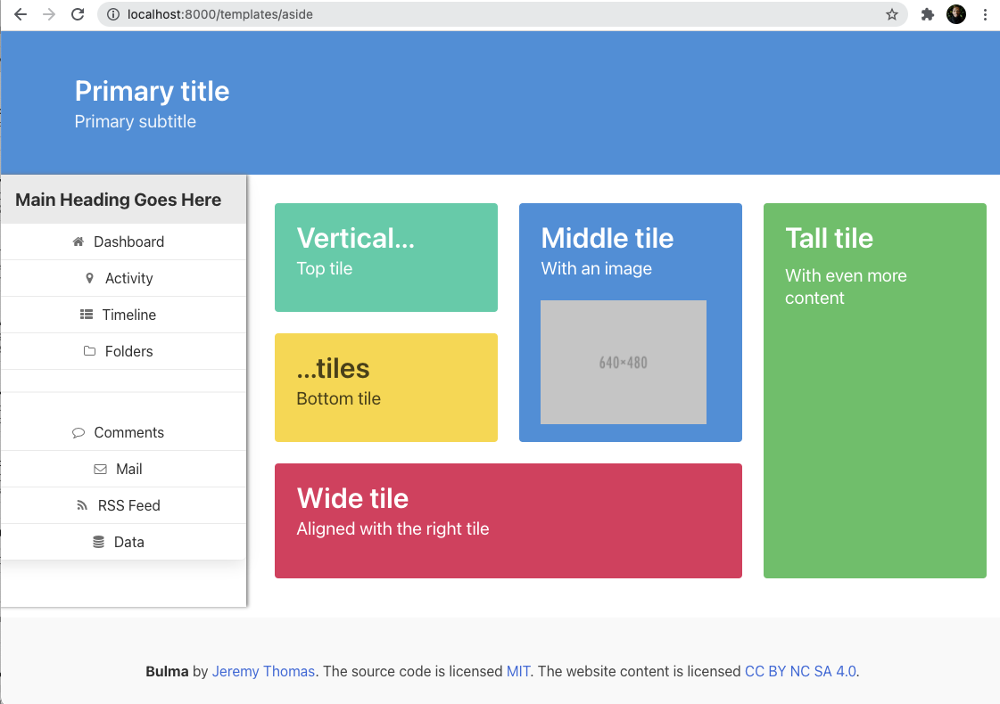

# Node Express Views

The purpose of this `deliverable` is to send up a file ( HTML ) as a response.

### Check the `index.js`

```js
const fs = require("fs");
const express = require("express");
const app = express();
const PORT = process.env.PORT || 8000;

app.use(express.urlencoded({ extended: false }));
app.use(express.static(__dirname + "/public"));

app.get("/", function (req, res) {
  res.sendFile(__dirname + "/views/index.html");
});

app.get("/templates/absurd", function (req, res) {
  res.sendFile(__dirname + "/views/templates/absurd.html");
});

app.get("/templates/admin", function (req, res) {
  res.sendFile(__dirname + "/views/templates/admin.html");
});

app.get("/templates/aside", function (req, res) {
  res.sendFile(__dirname + "/views/templates/aside.html");
});

app.listen(PORT, function () {
  console.log(`Server running on PORT ${PORT}`);
});
```

### `1` `/`

- [ ] `todo` Build the route `/` to send up the `index.html` file located inside of the `views` folder

```js
app.get("/", function (req, res) {
  res.sendFile(__dirname + "/views/index.html");
});
```

- [ ] to see the `index.html` file [{ here }](https://github.com/SEI-1025/node-express-templates/blob/main/views/index.html)

* `solution` The `index.js` file has the `/` route - which is located [**[here]**](https://github.com/SEI-1025/node-express-templates/blob/e4a0ac790602e5fa20fa945da868005ef0dd01b4/index.js#L9-L11)

#### `Result`


### `2` `/templates/admin`

- [ ] `todo` Build the route `/templates/admin` to send up the `admin.html` file located inside of the `templates` folder

```js
app.get("/templates/admin", function (req, res) {
  res.sendFile(__dirname + "/views/templates/admin.html");
});
```

- [ ] to see the `admin.html` file [{ here }](https://github.com/SEI-1025/node-express-templates/blob/main/views/templates/admin.html)

* `solution` The `index.js` file has the `/templates/admin` route - which is located [**[here]**](https://github.com/SEI-1025/node-express-templates/blob/e4a0ac790602e5fa20fa945da868005ef0dd01b4/index.js#L17-L19)

#### `Result`



### `3` `/templates/aside`

- [ ] `todo` Build the route `/templates/aside` to send up the `aside.html` file located inside of the `templates` folder

```js
app.get("/templates/aside`", function (req, res) {
  res.sendFile(__dirname + "/views/templates/aside.html");
});
```

- [ ] to see the `aside.html` file [{ here }](https://github.com/SEI-1025/node-express-templates/blob/main/views/templates/aside.html)

* `solution` The `index.js` file has the `/templates/admin` route - which is located [**[here]**](https://github.com/SEI-1025/node-express-templates/blob/e4a0ac790602e5fa20fa945da868005ef0dd01b4/index.js#L21-L23)

#### `Result`



### `4` `/templates/band`

- [ ] `todo` Build the route `/templates/band` to send up the `band.html` file located inside of the `templates` folder

```js
app.get("/templates/band`", function (req, res) {
  // write your response here
});
```

### `5` `/templates/blog`

- [ ] `todo` Build the route `/templates/blog` to send up the `blog.html` file located inside of the `templates` folder

```js
// route goes here
```

### `6` `/templates/cards`

- [ ] `todo` Build the route `/templates/cards` to send up the `cards.html` file located inside of the `templates` folder

```js
// route goes here
```

### `7` `/templates/contact`

- [ ] `todo` Build the route `/templates/contact` to send up the `contact.html` file located inside of the `templates` folder

```js
// route goes here
```

### `8` `/templates/inbox`

- [ ] `todo` Build the route `/templates/inbox` to send up the `inbox.html` file located inside of the `templates` folder

```js
// route goes here
```

### `9` `/templates/landing`

- [ ] `todo` Build the route `/templates/landing` to send up the `landing.html` file located inside of the `templates` folder

```js
// route goes here
```

### `10` `/templates/login`

- [ ] `todo` Build the route `/templates/login` to send up the `login.html` file located inside of the `templates` folder

```js
// route goes here
```

### `11` `/templates/register`

- [ ] `todo` Build the route `/templates/register` to send up the `register.html` file located inside of the `templates` folder

```js
// route goes here
```

### `12` `/templates/search`

- [ ] `todo` Build the route `/templates/search` to send up the `search.html` file located inside of the `templates` folder

```js
// route goes here
```

### `13` `/templates/showcase`

- [ ] `todo` Build the route `/templates/showcase` to send up the `showcase.html` file located inside of the `templates` folder

```js
// route goes here
```
